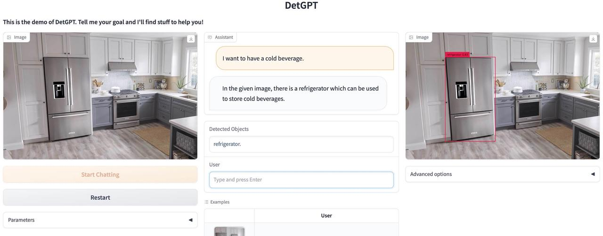
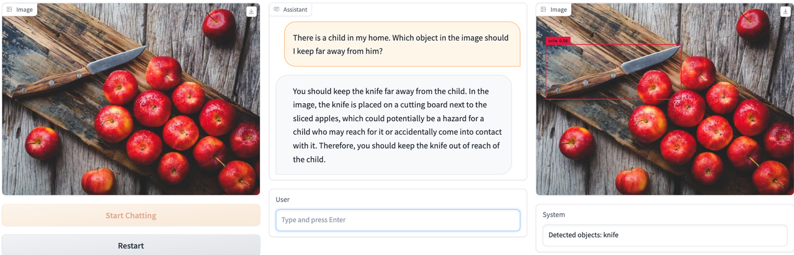
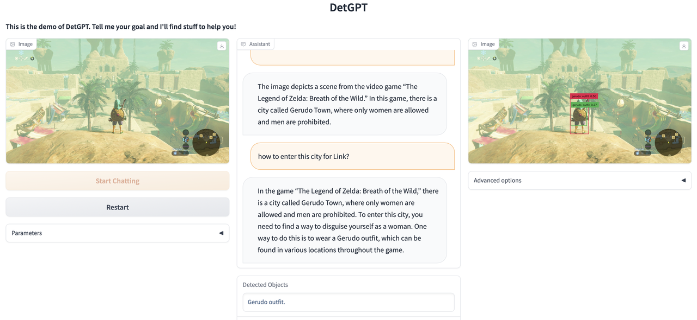
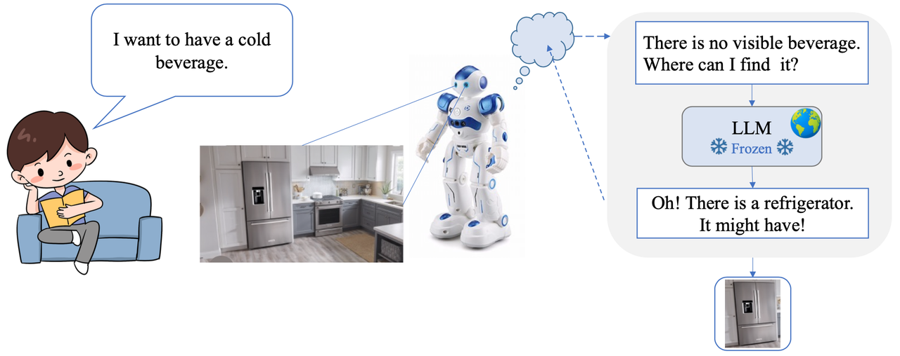

# DetGPT: Detect What You Need via Reasoning

[](https://a03e18d54fcb7ceb54.gradio.live)
[](https://detgpt.github.io/)
[](https://github.com/OptimalScale/DetGPT/blob/master/LICENSE.md)
[](https://www.python.org/downloads/release/python-390/)
[](https://discord.gg/u9VJNpzhvA)
[](https://join.slack.com/t/lmflow/shared_invite/zt-1s6egx12s-THlwHuCjF6~JGKmx7JoJPA)
[](https://i.328888.xyz/2023/05/08/i19P4Q.jpeg)

<a href="https://detgpt.github.io/"></a>

## News
* [2023-06-13] Added tuned linear weights for Vicuna-7b.
* [2023-05-25] Our paper is available at [this link](https://arxiv.org/abs/2305.14167).
* [2023-05-09] We have launched our [project website](https://detgpt.github.io).
* [2023-05-08] The first version of DetGPT is available now! Try our [demo](https://883e396b2a812343ca.gradio.live/).


## Online Demo
Due to high website traffic, we have created multiple online services. If one link is not working, please use another one. Thank you for your support!


[Demo](https://a4e0b9684150cac767.gradio.live)

[演示 (简体中文)](https://6b75a399f18e2f11fc.gradio.live)

[Demo (backup)](https://79488622297b24dad2.gradio.live)

[comment]: <> ([Demo4]&#40;https://b66150ee453d74dfeb.gradio.live/&#41;)


## Examples

  |   |
:-------------------------:
 | 
  |
  |  


## Features
<p align="center" width="100%">

</p>

- DetGPT locates target objects, not just describing images.
- DetGPT understands complex instructions, like "Find blood pressure-reducing foods in the image."
- DetGPT accurately localizes target objects via LLM reasoning. - For example, it can identify bananas as a potassium-rich food to alleviate high blood pressure.
- DetGPT provides answers beyond human common sense, like identifying unfamiliar fruits rich in potassium.


## Setup

**1. Installation**
```bash
git clone https://github.com/OptimalScale/DetGPT.git
cd DetGPT
conda create -n detgpt python=3.9 -y
conda activate detgpt
pip install -e .
```

**2. Install GroundingDino**
```bash
python -m pip install -e GroundingDINO
```

**2. Download the pretrained checkpoint**

Our model is based on pretrained language model checkpoints.
In our experiments, we use [Robin](https://github.com/OptimalScale/LMFlow#model-zoo) from [LMFlow team](https://github.com/OptimalScale/LMFlow), and [Vicuna](https://lmsys.org/blog/2023-03-30-vicuna/) and find they perform competitively well.
You can run following script to download the Robin checkpoint:
```
cd output_models
bash download.sh all
cd -
```
Merge the robin lora model with the original llama model and save the merged
model to `output_models/robin-7b`, where the corresponding model path is
specified in this config file
[here](detgpt/configs/models/detgpt_robin_7b.yaml#L16).

To obtain the original llama model, one may refer to this
[doc](https://optimalscale.github.io/LMFlow/examples/checkpoints.html). To
merge a lora model with a base model, one may refer to
[PEFT](https://github.com/huggingface/peft) or use the
[merge script](https://github.com/OptimalScale/LMFlow#53-reproduce-the-result)
provided by LMFlow.

## Training

The code will be released soon.

## Deploy Demo Locally
Run the demo by executing the following command. Replace 'path/to/pretrained_linear_weights' in the config file to the real path.  We currently release linear weights based on [Vicuna-13B-v1.1](https://github.com/lm-sys/FastChat#vicuna-weights) and will release other weights later. The demo runs on 2 GPUs by default, one for the language model and another for GroundingDino.

```
CUDA_VISIBLE_DEVICES=0,1 python demo_detgpt.py --cfg-path configs/detgpt_tasktune_13b_coco.yaml
```


## Acknowledgement
The project is built on top of the amazing open-vocabulary detector [GroundingDino](https://github.com/IDEA-Research/GroundingDINO) and multimodal conversation model [MiniGPT-4](https://github.com/Vision-CAIR/MiniGPT-4), which is based on [BLIP2](https://huggingface.co/docs/transformers/main/model_doc/blip-2) and [Lavis](https://github.com/salesforce/LAVIS). 
Thanks for these great work!


If you're using DetGPT in your research or applications, please cite using this BibTeX:
```bibtex
@misc{pi2023detgpt,
      title={DetGPT: Detect What You Need via Reasoning}, 
      author={Renjie Pi and Jiahui Gao and Shizhe Diao and Rui Pan and Hanze Dong and Jipeng Zhang and Lewei Yao and Jianhua Han and Hang Xu and Lingpeng Kong and Tong Zhang},
      year={2023},
      eprint={2305.14167},
      archivePrefix={arXiv},
      primaryClass={cs.CV}
}
```


## License
This repository is released under [BSD 3-Clause License](LICENSE.md).
